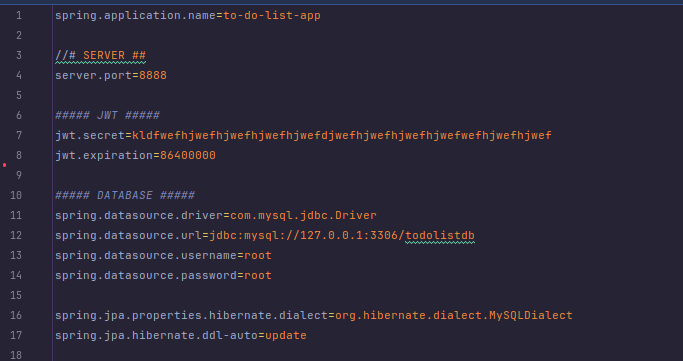

# Project: Aplikasi To Do List

## Apllication Properties


## Initialization DB
```bash
insert into category (name) values ('Personal');
insert into category (name) values ('Work');
insert into category (name) values ('Study');
```

## Choosen Role (Enum)

- ADMIN : "admin"
- USER : "user"


## Start Application
```bash
mvn spring-boot:run
```

API collection for Aplikasi To Do List

published at : https://documenter.getpostman.com/view/33287012/2sA3kPo4LB

# 📁 Collection: Authentication 


## End-point: Login
### Method: POST
>```
>http://localhost:8888/api/auth/login
>```
### Headers

|Content-Type|Value|
|---|---|
|Content-Type|application/json|


### Body (**raw**)

```json
{
    "username": "string",
    "password": "string"
}
```


⁃ ⁃ ⁃ ⁃ ⁃ ⁃ ⁃ ⁃ ⁃ ⁃ ⁃ ⁃ ⁃ ⁃ ⁃ ⁃ ⁃ ⁃ ⁃ ⁃ ⁃ ⁃ ⁃ ⁃ ⁃ ⁃ ⁃ ⁃ ⁃ ⁃ ⁃ ⁃ ⁃ ⁃ ⁃ ⁃ ⁃ ⁃ ⁃ ⁃ ⁃ ⁃ ⁃ ⁃ ⁃ ⁃ ⁃

## End-point: Register
### Method: POST
>```
>http://localhost:8888/api/auth/register
>```
### Headers

|Content-Type|Value|
|---|---|
|Content-Type|application/json|


### Body (**raw**)

```json
{
    "username": "string",
    "email": "email@gmail.com",
    "password": "string",
    "roles": [
        "user",
        "admin"
    ]
}
```


⁃ ⁃ ⁃ ⁃ ⁃ ⁃ ⁃ ⁃ ⁃ ⁃ ⁃ ⁃ ⁃ ⁃ ⁃ ⁃ ⁃ ⁃ ⁃ ⁃ ⁃ ⁃ ⁃ ⁃ ⁃ ⁃ ⁃ ⁃ ⁃ ⁃ ⁃ ⁃ ⁃ ⁃ ⁃ ⁃ ⁃ ⁃ ⁃ ⁃ ⁃ ⁃ ⁃ ⁃ ⁃ ⁃ ⁃
# 📁 Collection: With Auth 


## End-point: Get All Todos
### Method: GET
>```
>http://localhost:8888/api/todos
>```
### 🔑 Authentication bearer

|Param|value|Type|
|---|---|---|
|token|{{token}}|string|


⁃ ⁃ ⁃ ⁃ ⁃ ⁃ ⁃ ⁃ ⁃ ⁃ ⁃ ⁃ ⁃ ⁃ ⁃ ⁃ ⁃ ⁃ ⁃ ⁃ ⁃ ⁃ ⁃ ⁃ ⁃ ⁃ ⁃ ⁃ ⁃ ⁃ ⁃ ⁃ ⁃ ⁃ ⁃ ⁃ ⁃ ⁃ ⁃ ⁃ ⁃ ⁃ ⁃ ⁃ ⁃ ⁃ ⁃

## End-point: Create Todo
### Method: POST
>```
>http://localhost:8888/api/todos
>```
### Headers

|Content-Type|Value|
|---|---|
|Content-Type|application/json|


### Body (**raw**)

```json
{
    "task": "string",
    "deadline": "dd-MM-yyyy",
    "completed": false,
    "userId": "number",
    "categoryId": "number"
}
```

### 🔑 Authentication bearer

|Param|value|Type|
|---|---|---|
|token|{{token}}|string|


⁃ ⁃ ⁃ ⁃ ⁃ ⁃ ⁃ ⁃ ⁃ ⁃ ⁃ ⁃ ⁃ ⁃ ⁃ ⁃ ⁃ ⁃ ⁃ ⁃ ⁃ ⁃ ⁃ ⁃ ⁃ ⁃ ⁃ ⁃ ⁃ ⁃ ⁃ ⁃ ⁃ ⁃ ⁃ ⁃ ⁃ ⁃ ⁃ ⁃ ⁃ ⁃ ⁃ ⁃ ⁃ ⁃ ⁃

## End-point: Get Todo by ID
### Method: GET
>```
>http://localhost:8888/api/todos/:id
>```
### 🔑 Authentication bearer

|Param|value|Type|
|---|---|---|
|token|{{token}}|string|


⁃ ⁃ ⁃ ⁃ ⁃ ⁃ ⁃ ⁃ ⁃ ⁃ ⁃ ⁃ ⁃ ⁃ ⁃ ⁃ ⁃ ⁃ ⁃ ⁃ ⁃ ⁃ ⁃ ⁃ ⁃ ⁃ ⁃ ⁃ ⁃ ⁃ ⁃ ⁃ ⁃ ⁃ ⁃ ⁃ ⁃ ⁃ ⁃ ⁃ ⁃ ⁃ ⁃ ⁃ ⁃ ⁃ ⁃

## End-point: Update Todo
### Method: PUT
>```
>http://localhost:8888/api/todos/:id
>```
### Headers

|Content-Type|Value|
|---|---|
|Content-Type|application/json|


### Body (**raw**)

```json
{
    "task": "string",
    "deadline": "dd-MM-yyyy",
    "completed": false,
    "userId": "number",
    "categoryId": "number"
}
```

### 🔑 Authentication bearer

|Param|value|Type|
|---|---|---|
|token|{{token}}|string|


⁃ ⁃ ⁃ ⁃ ⁃ ⁃ ⁃ ⁃ ⁃ ⁃ ⁃ ⁃ ⁃ ⁃ ⁃ ⁃ ⁃ ⁃ ⁃ ⁃ ⁃ ⁃ ⁃ ⁃ ⁃ ⁃ ⁃ ⁃ ⁃ ⁃ ⁃ ⁃ ⁃ ⁃ ⁃ ⁃ ⁃ ⁃ ⁃ ⁃ ⁃ ⁃ ⁃ ⁃ ⁃ ⁃ ⁃

## End-point: Delete Todo
### Method: DELETE
>```
>http://localhost:8888/api/todos/:id
>```
### 🔑 Authentication bearer

|Param|value|Type|
|---|---|---|
|token|{{token}}|string|


⁃ ⁃ ⁃ ⁃ ⁃ ⁃ ⁃ ⁃ ⁃ ⁃ ⁃ ⁃ ⁃ ⁃ ⁃ ⁃ ⁃ ⁃ ⁃ ⁃ ⁃ ⁃ ⁃ ⁃ ⁃ ⁃ ⁃ ⁃ ⁃ ⁃ ⁃ ⁃ ⁃ ⁃ ⁃ ⁃ ⁃ ⁃ ⁃ ⁃ ⁃ ⁃ ⁃ ⁃ ⁃ ⁃ ⁃

## End-point: Get All Users
### Method: GET
>```
>http://localhost:8888/api/users
>```
### 🔑 Authentication bearer

|Param|value|Type|
|---|---|---|
|token|{{token}}|string|


⁃ ⁃ ⁃ ⁃ ⁃ ⁃ ⁃ ⁃ ⁃ ⁃ ⁃ ⁃ ⁃ ⁃ ⁃ ⁃ ⁃ ⁃ ⁃ ⁃ ⁃ ⁃ ⁃ ⁃ ⁃ ⁃ ⁃ ⁃ ⁃ ⁃ ⁃ ⁃ ⁃ ⁃ ⁃ ⁃ ⁃ ⁃ ⁃ ⁃ ⁃ ⁃ ⁃ ⁃ ⁃ ⁃ ⁃

## End-point: Create User
### Method: POST
>```
>http://localhost:8888/api/users
>```
### Headers

|Content-Type|Value|
|---|---|
|Content-Type|application/json|


### Body (**raw**)

```json
{
  "username": "string",
  "email": "email@gmail.com",
  "password": "string",
  "roles":[]
}
```

### 🔑 Authentication bearer

|Param|value|Type|
|---|---|---|
|token|{{token}}|string|


⁃ ⁃ ⁃ ⁃ ⁃ ⁃ ⁃ ⁃ ⁃ ⁃ ⁃ ⁃ ⁃ ⁃ ⁃ ⁃ ⁃ ⁃ ⁃ ⁃ ⁃ ⁃ ⁃ ⁃ ⁃ ⁃ ⁃ ⁃ ⁃ ⁃ ⁃ ⁃ ⁃ ⁃ ⁃ ⁃ ⁃ ⁃ ⁃ ⁃ ⁃ ⁃ ⁃ ⁃ ⁃ ⁃ ⁃

## End-point: Get User by ID
### Method: GET
>```
>http://localhost:8888/api/users/:id
>```
### 🔑 Authentication bearer

|Param|value|Type|
|---|---|---|
|token|{{token}}|string|


⁃ ⁃ ⁃ ⁃ ⁃ ⁃ ⁃ ⁃ ⁃ ⁃ ⁃ ⁃ ⁃ ⁃ ⁃ ⁃ ⁃ ⁃ ⁃ ⁃ ⁃ ⁃ ⁃ ⁃ ⁃ ⁃ ⁃ ⁃ ⁃ ⁃ ⁃ ⁃ ⁃ ⁃ ⁃ ⁃ ⁃ ⁃ ⁃ ⁃ ⁃ ⁃ ⁃ ⁃ ⁃ ⁃ ⁃

## End-point: Update User
### Method: PUT
>```
>http://localhost:8888/api/users/2
>```
### Headers

|Content-Type|Value|
|---|---|
|Content-Type|application/json|


### Body (**raw**)

```json
{
    "username": "string",
    "email": "email@gmail.com",
    "password": "string",
    "roles": [
        "admin"
    ]
}

```

### 🔑 Authentication bearer

|Param|value|Type|
|---|---|---|
|token|{{token}}|string|


⁃ ⁃ ⁃ ⁃ ⁃ ⁃ ⁃ ⁃ ⁃ ⁃ ⁃ ⁃ ⁃ ⁃ ⁃ ⁃ ⁃ ⁃ ⁃ ⁃ ⁃ ⁃ ⁃ ⁃ ⁃ ⁃ ⁃ ⁃ ⁃ ⁃ ⁃ ⁃ ⁃ ⁃ ⁃ ⁃ ⁃ ⁃ ⁃ ⁃ ⁃ ⁃ ⁃ ⁃ ⁃ ⁃ ⁃

## End-point: Delete User
### Method: DELETE
>```
>http://localhost:8888/api/users/:id
>```
### 🔑 Authentication bearer

|Param|value|Type|
|---|---|---|
|token|{{token}}|string|


⁃ ⁃ ⁃ ⁃ ⁃ ⁃ ⁃ ⁃ ⁃ ⁃ ⁃ ⁃ ⁃ ⁃ ⁃ ⁃ ⁃ ⁃ ⁃ ⁃ ⁃ ⁃ ⁃ ⁃ ⁃ ⁃ ⁃ ⁃ ⁃ ⁃ ⁃ ⁃ ⁃ ⁃ ⁃ ⁃ ⁃ ⁃ ⁃ ⁃ ⁃ ⁃ ⁃ ⁃ ⁃ ⁃ ⁃

## End-point: Get All Categories
### Method: GET
>```
>http://localhost:8888/api/categories
>```
### 🔑 Authentication bearer

|Param|value|Type|
|---|---|---|
|token|{{token}}|string|


⁃ ⁃ ⁃ ⁃ ⁃ ⁃ ⁃ ⁃ ⁃ ⁃ ⁃ ⁃ ⁃ ⁃ ⁃ ⁃ ⁃ ⁃ ⁃ ⁃ ⁃ ⁃ ⁃ ⁃ ⁃ ⁃ ⁃ ⁃ ⁃ ⁃ ⁃ ⁃ ⁃ ⁃ ⁃ ⁃ ⁃ ⁃ ⁃ ⁃ ⁃ ⁃ ⁃ ⁃ ⁃ ⁃ ⁃

## End-point: Create Category
### Method: POST
>```
>http://localhost:8888/api/categories
>```
### Headers

|Content-Type|Value|
|---|---|
|Content-Type|application/json|


### Body (**raw**)

```json
{
  "name": "string"
}
```

### 🔑 Authentication bearer

|Param|value|Type|
|---|---|---|
|token|{{token}}|string|


⁃ ⁃ ⁃ ⁃ ⁃ ⁃ ⁃ ⁃ ⁃ ⁃ ⁃ ⁃ ⁃ ⁃ ⁃ ⁃ ⁃ ⁃ ⁃ ⁃ ⁃ ⁃ ⁃ ⁃ ⁃ ⁃ ⁃ ⁃ ⁃ ⁃ ⁃ ⁃ ⁃ ⁃ ⁃ ⁃ ⁃ ⁃ ⁃ ⁃ ⁃ ⁃ ⁃ ⁃ ⁃ ⁃ ⁃

## End-point: Get Category by ID
### Method: GET
>```
>http://localhost:8888/api/categories/:id
>```
### 🔑 Authentication bearer

|Param|value|Type|
|---|---|---|
|token|{{token}}|string|


⁃ ⁃ ⁃ ⁃ ⁃ ⁃ ⁃ ⁃ ⁃ ⁃ ⁃ ⁃ ⁃ ⁃ ⁃ ⁃ ⁃ ⁃ ⁃ ⁃ ⁃ ⁃ ⁃ ⁃ ⁃ ⁃ ⁃ ⁃ ⁃ ⁃ ⁃ ⁃ ⁃ ⁃ ⁃ ⁃ ⁃ ⁃ ⁃ ⁃ ⁃ ⁃ ⁃ ⁃ ⁃ ⁃ ⁃

## End-point: Update Category
### Method: PUT
>```
>http://localhost:8888/api/categories/:id
>```
### Headers

|Content-Type|Value|
|---|---|
|Content-Type|application/json|


### Body (**raw**)

```json
{
  "name": "string"
}
```

### 🔑 Authentication bearer

|Param|value|Type|
|---|---|---|
|token|{{token}}|string|


⁃ ⁃ ⁃ ⁃ ⁃ ⁃ ⁃ ⁃ ⁃ ⁃ ⁃ ⁃ ⁃ ⁃ ⁃ ⁃ ⁃ ⁃ ⁃ ⁃ ⁃ ⁃ ⁃ ⁃ ⁃ ⁃ ⁃ ⁃ ⁃ ⁃ ⁃ ⁃ ⁃ ⁃ ⁃ ⁃ ⁃ ⁃ ⁃ ⁃ ⁃ ⁃ ⁃ ⁃ ⁃ ⁃ ⁃

## End-point: Delete Category
### Method: DELETE
>```
>http://localhost:8888/api/categories/:id
>```
### 🔑 Authentication bearer

|Param|value|Type|
|---|---|---|
|token|{{token}}|string|


⁃ ⁃ ⁃ ⁃ ⁃ ⁃ ⁃ ⁃ ⁃ ⁃ ⁃ ⁃ ⁃ ⁃ ⁃ ⁃ ⁃ ⁃ ⁃ ⁃ ⁃ ⁃ ⁃ ⁃ ⁃ ⁃ ⁃ ⁃ ⁃ ⁃ ⁃ ⁃ ⁃ ⁃ ⁃ ⁃ ⁃ ⁃ ⁃ ⁃ ⁃ ⁃ ⁃ ⁃ ⁃ ⁃ ⁃

## End-point: Get All Comments
### Method: GET
>```
>http://localhost:8888/api/comment
>```
### 🔑 Authentication bearer

|Param|value|Type|
|---|---|---|
|token|{{token}}|string|


⁃ ⁃ ⁃ ⁃ ⁃ ⁃ ⁃ ⁃ ⁃ ⁃ ⁃ ⁃ ⁃ ⁃ ⁃ ⁃ ⁃ ⁃ ⁃ ⁃ ⁃ ⁃ ⁃ ⁃ ⁃ ⁃ ⁃ ⁃ ⁃ ⁃ ⁃ ⁃ ⁃ ⁃ ⁃ ⁃ ⁃ ⁃ ⁃ ⁃ ⁃ ⁃ ⁃ ⁃ ⁃ ⁃ ⁃

## End-point: Create Comment
### Method: POST
>```
>http://localhost:8888/api/comment
>```
### Headers

|Content-Type|Value|
|---|---|
|Content-Type|application/json|


### Body (**raw**)

```json
{
    "userId": "number",
    "body": "string",
    "todoId": "number"
}
```

### 🔑 Authentication bearer

|Param|value|Type|
|---|---|---|
|token|{{token}}|string|


⁃ ⁃ ⁃ ⁃ ⁃ ⁃ ⁃ ⁃ ⁃ ⁃ ⁃ ⁃ ⁃ ⁃ ⁃ ⁃ ⁃ ⁃ ⁃ ⁃ ⁃ ⁃ ⁃ ⁃ ⁃ ⁃ ⁃ ⁃ ⁃ ⁃ ⁃ ⁃ ⁃ ⁃ ⁃ ⁃ ⁃ ⁃ ⁃ ⁃ ⁃ ⁃ ⁃ ⁃ ⁃ ⁃ ⁃

## End-point: Get Comment by ID
### Method: GET
>```
>http://localhost:8888/api/comment/:id
>```
### 🔑 Authentication bearer

|Param|value|Type|
|---|---|---|
|token|{{token}}|string|


⁃ ⁃ ⁃ ⁃ ⁃ ⁃ ⁃ ⁃ ⁃ ⁃ ⁃ ⁃ ⁃ ⁃ ⁃ ⁃ ⁃ ⁃ ⁃ ⁃ ⁃ ⁃ ⁃ ⁃ ⁃ ⁃ ⁃ ⁃ ⁃ ⁃ ⁃ ⁃ ⁃ ⁃ ⁃ ⁃ ⁃ ⁃ ⁃ ⁃ ⁃ ⁃ ⁃ ⁃ ⁃ ⁃ ⁃

## End-point: Update Comment
### Method: PUT
>```
>http://localhost:8888/api/comment/:id
>```
### Headers

|Content-Type|Value|
|---|---|
|Content-Type|application/json|


### Body (**raw**)

```json
{
  "body": "string"
}
```

### 🔑 Authentication bearer

|Param|value|Type|
|---|---|---|
|token|{{token}}|string|


⁃ ⁃ ⁃ ⁃ ⁃ ⁃ ⁃ ⁃ ⁃ ⁃ ⁃ ⁃ ⁃ ⁃ ⁃ ⁃ ⁃ ⁃ ⁃ ⁃ ⁃ ⁃ ⁃ ⁃ ⁃ ⁃ ⁃ ⁃ ⁃ ⁃ ⁃ ⁃ ⁃ ⁃ ⁃ ⁃ ⁃ ⁃ ⁃ ⁃ ⁃ ⁃ ⁃ ⁃ ⁃ ⁃ ⁃

## End-point: Delete Comment
### Method: DELETE
>```
>http://localhost:8888/api/comment/:id
>```
### 🔑 Authentication bearer

|Param|value|Type|
|---|---|---|
|token|{{token}}|string|


⁃ ⁃ ⁃ ⁃ ⁃ ⁃ ⁃ ⁃ ⁃ ⁃ ⁃ ⁃ ⁃ ⁃ ⁃ ⁃ ⁃ ⁃ ⁃ ⁃ ⁃ ⁃ ⁃ ⁃ ⁃ ⁃ ⁃ ⁃ ⁃ ⁃ ⁃ ⁃ ⁃ ⁃ ⁃ ⁃ ⁃ ⁃ ⁃ ⁃ ⁃ ⁃ ⁃ ⁃ ⁃ ⁃ ⁃

## End-point: Create Todo
### Method: POST
>```
>http://localhost:8888/api/user/:user_id/todos
>```
### Body (**raw**)

```json
{
    "task": "task",
    "deadline": "dd-MM-yyyy",
    "categoryId": "number"
}
```

### 🔑 Authentication bearer

|Param|value|Type|
|---|---|---|
|token|{{token}}|string|


⁃ ⁃ ⁃ ⁃ ⁃ ⁃ ⁃ ⁃ ⁃ ⁃ ⁃ ⁃ ⁃ ⁃ ⁃ ⁃ ⁃ ⁃ ⁃ ⁃ ⁃ ⁃ ⁃ ⁃ ⁃ ⁃ ⁃ ⁃ ⁃ ⁃ ⁃ ⁃ ⁃ ⁃ ⁃ ⁃ ⁃ ⁃ ⁃ ⁃ ⁃ ⁃ ⁃ ⁃ ⁃ ⁃ ⁃

## End-point: Update Todo
### Method: PUT
>```
>http://localhost:8888/api/user/:user_id/todos
>```
### Body (**raw**)

```json
{
    "task": "task",
    "deadline": "dd-MM-yyyy",
    "categoryId": "number"
}
```

### 🔑 Authentication bearer

|Param|value|Type|
|---|---|---|
|token|{{token}}|string|


⁃ ⁃ ⁃ ⁃ ⁃ ⁃ ⁃ ⁃ ⁃ ⁃ ⁃ ⁃ ⁃ ⁃ ⁃ ⁃ ⁃ ⁃ ⁃ ⁃ ⁃ ⁃ ⁃ ⁃ ⁃ ⁃ ⁃ ⁃ ⁃ ⁃ ⁃ ⁃ ⁃ ⁃ ⁃ ⁃ ⁃ ⁃ ⁃ ⁃ ⁃ ⁃ ⁃ ⁃ ⁃ ⁃ ⁃

## End-point: Checkked Todo
### Method: POST
>```
>http://localhost:8888/api/user/:user_id/todos/checked/:todo_id
>```
### Body (**raw**)

```json
{
    "completed":true
}
```

### 🔑 Authentication bearer

|Param|value|Type|
|---|---|---|
|token|{{token}}|string|


⁃ ⁃ ⁃ ⁃ ⁃ ⁃ ⁃ ⁃ ⁃ ⁃ ⁃ ⁃ ⁃ ⁃ ⁃ ⁃ ⁃ ⁃ ⁃ ⁃ ⁃ ⁃ ⁃ ⁃ ⁃ ⁃ ⁃ ⁃ ⁃ ⁃ ⁃ ⁃ ⁃ ⁃ ⁃ ⁃ ⁃ ⁃ ⁃ ⁃ ⁃ ⁃ ⁃ ⁃ ⁃ ⁃ ⁃

## End-point: Get User Todos
### Method: GET
>```
>http://localhost:8888/api/user/:user_id/todos
>```
### 🔑 Authentication bearer

|Param|value|Type|
|---|---|---|
|token|{{token}}|string|


⁃ ⁃ ⁃ ⁃ ⁃ ⁃ ⁃ ⁃ ⁃ ⁃ ⁃ ⁃ ⁃ ⁃ ⁃ ⁃ ⁃ ⁃ ⁃ ⁃ ⁃ ⁃ ⁃ ⁃ ⁃ ⁃ ⁃ ⁃ ⁃ ⁃ ⁃ ⁃ ⁃ ⁃ ⁃ ⁃ ⁃ ⁃ ⁃ ⁃ ⁃ ⁃ ⁃ ⁃ ⁃ ⁃ ⁃

## End-point: Get User Todos By Completed
### Method: GET
>```
>http://localhost:8888/api/user/:user_id/todos?completed=true
>```
### Query Params

|Param|value|
|---|---|
|completed|true|


### 🔑 Authentication bearer

|Param|value|Type|
|---|---|---|
|token|{{token}}|string|


⁃ ⁃ ⁃ ⁃ ⁃ ⁃ ⁃ ⁃ ⁃ ⁃ ⁃ ⁃ ⁃ ⁃ ⁃ ⁃ ⁃ ⁃ ⁃ ⁃ ⁃ ⁃ ⁃ ⁃ ⁃ ⁃ ⁃ ⁃ ⁃ ⁃ ⁃ ⁃ ⁃ ⁃ ⁃ ⁃ ⁃ ⁃ ⁃ ⁃ ⁃ ⁃ ⁃ ⁃ ⁃ ⁃ ⁃

## End-point: Search User Todos
### Method: GET
>```
>http://localhost:8888/api/user/:user_id/todos?search=search_key
>```
### Query Params

|Param|value|
|---|---|
|search|search_key|


### 🔑 Authentication bearer

|Param|value|Type|
|---|---|---|
|token|{{token}}|string|


⁃ ⁃ ⁃ ⁃ ⁃ ⁃ ⁃ ⁃ ⁃ ⁃ ⁃ ⁃ ⁃ ⁃ ⁃ ⁃ ⁃ ⁃ ⁃ ⁃ ⁃ ⁃ ⁃ ⁃ ⁃ ⁃ ⁃ ⁃ ⁃ ⁃ ⁃ ⁃ ⁃ ⁃ ⁃ ⁃ ⁃ ⁃ ⁃ ⁃ ⁃ ⁃ ⁃ ⁃ ⁃ ⁃ ⁃

## End-point: Get User Todos by Category
### Method: GET
>```
>http://localhost:8888/api/user/:user_id/todos?category=category_name
>```
### Query Params

|Param|value|
|---|---|
|category|category_name|


### 🔑 Authentication bearer

|Param|value|Type|
|---|---|---|
|token|{{token}}|string|


⁃ ⁃ ⁃ ⁃ ⁃ ⁃ ⁃ ⁃ ⁃ ⁃ ⁃ ⁃ ⁃ ⁃ ⁃ ⁃ ⁃ ⁃ ⁃ ⁃ ⁃ ⁃ ⁃ ⁃ ⁃ ⁃ ⁃ ⁃ ⁃ ⁃ ⁃ ⁃ ⁃ ⁃ ⁃ ⁃ ⁃ ⁃ ⁃ ⁃ ⁃ ⁃ ⁃ ⁃ ⁃ ⁃ ⁃

## End-point: Get User Todo Comments
### Method: GET
>```
>http://localhost:8888/api/user/:user_id/:todo_id/comments
>```
### 🔑 Authentication bearer

|Param|value|Type|
|---|---|---|
|token|{{token}}|string|


⁃ ⁃ ⁃ ⁃ ⁃ ⁃ ⁃ ⁃ ⁃ ⁃ ⁃ ⁃ ⁃ ⁃ ⁃ ⁃ ⁃ ⁃ ⁃ ⁃ ⁃ ⁃ ⁃ ⁃ ⁃ ⁃ ⁃ ⁃ ⁃ ⁃ ⁃ ⁃ ⁃ ⁃ ⁃ ⁃ ⁃ ⁃ ⁃ ⁃ ⁃ ⁃ ⁃ ⁃ ⁃ ⁃ ⁃

## End-point: Create Comment User Todo
### Method: POST
>```
>http://localhost:8888/api/user/:user_id/:todo_id/comments
>```
### Body (**raw**)

```json
{
  "body": "string comment"
}
```

### 🔑 Authentication bearer

|Param|value|Type|
|---|---|---|
|token|{{token}}|string|


⁃ ⁃ ⁃ ⁃ ⁃ ⁃ ⁃ ⁃ ⁃ ⁃ ⁃ ⁃ ⁃ ⁃ ⁃ ⁃ ⁃ ⁃ ⁃ ⁃ ⁃ ⁃ ⁃ ⁃ ⁃ ⁃ ⁃ ⁃ ⁃ ⁃ ⁃ ⁃ ⁃ ⁃ ⁃ ⁃ ⁃ ⁃ ⁃ ⁃ ⁃ ⁃ ⁃ ⁃ ⁃ ⁃ ⁃

## End-point: Update Comment User Todo
### Method: PUT
>```
>http://localhost:8888/api/user/:user_id/:todo_id/comments/:comment_id
>```
### Body (**raw**)

```json
{
  "body": "string comment"
}
```

### 🔑 Authentication bearer

|Param|value|Type|
|---|---|---|
|token|{{token}}|string|


⁃ ⁃ ⁃ ⁃ ⁃ ⁃ ⁃ ⁃ ⁃ ⁃ ⁃ ⁃ ⁃ ⁃ ⁃ ⁃ ⁃ ⁃ ⁃ ⁃ ⁃ ⁃ ⁃ ⁃ ⁃ ⁃ ⁃ ⁃ ⁃ ⁃ ⁃ ⁃ ⁃ ⁃ ⁃ ⁃ ⁃ ⁃ ⁃ ⁃ ⁃ ⁃ ⁃ ⁃ ⁃ ⁃ ⁃
_________________________________________________
Powered By: [postman-to-markdown](https://github.com/bautistaj/postman-to-markdown/)
